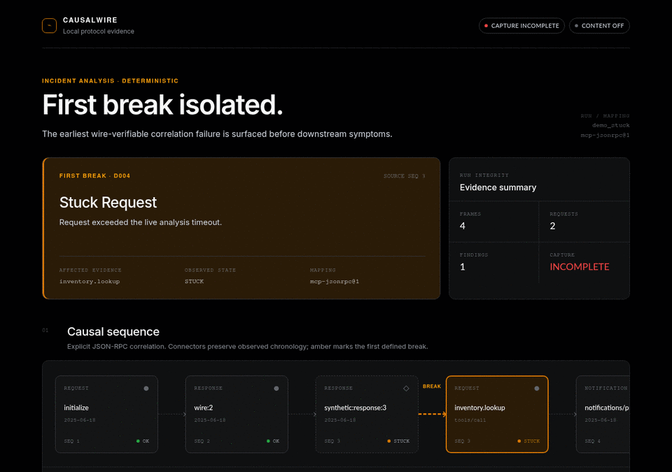

# causalwire

> **A local flight recorder for MCP: capture stdio, find the first broken causal edge, and export the evidence to OpenTelemetry.**

[](https://github.com/black-leg-nameko/causalwire/actions/workflows/ci.yml) [](https://www.npmjs.com/package/causalwire)  [](LICENSE)



## 60-second quickstart

```bash
npx -y causalwire@latest demo
```

No account, API key, Docker, config file, or network backend is required. The command prints `FIRST BREAK D004` and writes a standalone HTML/SVG incident view. Before the first npm release, reproduce the same path from the packed tarball with `corepack pnpm pack:artifact && corepack pnpm smoke:pack`.

Record a real MCP stdio server without changing its code:

```bash
causalwire record -- node ./dist/server.js
```

> **Privacy boundary:** content is **off by default**, so payloads and plaintext request IDs are not journaled. Method/tool names, sizes, fingerprints, and hashes can still be sensitive metadata. A hash is not redaction or anonymization. `--content full` stores exact frame bytes and is always an explicit opt-in.

causalwire sits between an MCP client and child server, forwards stdin/stdout bytes unchanged, and writes a local append-only JournalV1. Deterministic diagnostics turn that evidence into the same GraphV1 for terminal, standalone HTML/SVG, and OTLP output. No signup, backend, Docker, API key, or network telemetry is required.

## Inspect and export

```bash
causalwire inspect .causalwire/runs/<run>.jsonl
causalwire inspect .causalwire/runs/<run>.jsonl --format dag

causalwire export .causalwire/runs/<run>.jsonl --format html --out incident.html
causalwire export .causalwire/runs/<run>.jsonl --format svg --out incident.svg
causalwire export .causalwire/runs/<run>.jsonl --format otlp-json --out incident.otlp.json
```

Send metadata-only evidence to an existing OTLP/HTTP receiver:

```bash
OTEL_EXPORTER_OTLP_ENDPOINT=http://localhost:4318 \
  causalwire export .causalwire/runs/<run>.jsonl --format otlp
```

Without an endpoint, OTLP export exits 78 and makes no network connection. Standard `OTEL_EXPORTER_OTLP_HEADERS` and `OTEL_EXPORTER_OTLP_TIMEOUT` are supported; header values are never logged.

## Why causalwire

| | causalwire | SDK tracing | Packet/log inspection |
|---|---|---|---|
| Requires server code changes | No | Usually | No |
| Preserves MCP request/response correlation | Yes, from stdio wire evidence | SDK-dependent | Manual |
| Works without a hosted backend | Yes | Varies | Yes |
| Re-normalizes the same local evidence | Yes, versioned GraphV1 mapping | Backend-dependent | Manual |
| Claims semantic root cause | No | Varies | No |

- **Find the first defined protocol break**, rather than sorting unrelated logs by timestamp.
- **Keep content local and off by default**, while retaining bounded wire metadata useful for diagnosis.
- **Export one deterministic graph** to CLI, self-contained HTML/SVG, offline OTLP JSON, or an explicitly configured OTLP endpoint.
- **Wrap an existing stdio server**, without SDK instrumentation or a new backend.

## What it diagnoses

The MVP reports deterministic, wire-verifiable protocol failures: malformed frames, duplicate in-flight IDs, orphan responses, stuck/missing responses, orphan progress, capture truncation, protocol version conflict, and matched tool errors. “First break” means the earliest defined protocol correlation break—not semantic root-cause analysis.

The bundled synthetic scenarios are:

- `stuck-tool`: `inventory.lookup` never responds → D004.
- `orphan-result`: `shipping.quote` result has no request → D003.
- `duplicate-id`: two in-flight calls reuse one ID → D002.

```bash
causalwire demo --scenario orphan-result
causalwire demo --scenario duplicate-id
```

## Library API

```ts
import { analyzeJournal, renderHtml, renderSvg, recordChild, toOtlp } from 'causalwire';

const graph = await analyzeJournal('.causalwire/runs/example.jsonl');
const html = renderHtml(graph);
```

Public types include `JournalRecord`, `GraphV1`, `Diagnostic`, and `NormalizerPack`. Programmatic normalizers and diagnostic detectors are extension points; dynamic CLI plugin loading is intentionally out of scope.

## Reproduce verification

```bash
corepack pnpm install --frozen-lockfile
corepack pnpm lint
corepack pnpm typecheck
corepack pnpm test
corepack pnpm test:integration
corepack pnpm test:e2e
corepack pnpm test:conformance
corepack pnpm test:security
corepack pnpm bench:capture
corepack pnpm bench:child
corepack pnpm build
corepack pnpm pack:artifact
corepack pnpm smoke:pack
corepack pnpm audit:repo
```

Current local evidence:

- Seeded failure accuracy: **20/20 exact code + source sequence + node (100%)** across five fault families. Controls are excluded from the denominator. See [`artifacts/reports/accuracy.md`](artifacts/reports/accuracy.md).
- Capture shadow-path benchmark: **2.402 ms maximum incremental p95**, byte mismatch/drop/reorder **0/0/0**, on Linux WSL2, Node 22.23.1, Intel i7-1165G7. See [`artifacts/reports/capture-overhead.md`](artifacts/reports/capture-overhead.md).
- Packaged child-process benchmark: **4.518 ms maximum incremental p95**, byte mismatch **0**, on the same local Linux/Node 22 host. See [`artifacts/reports/child-process-overhead.md`](artifacts/reports/child-process-overhead.md).
- Browser QA: Chromium at 1280/768/375 px, success and empty states, zero console errors or failed requests. See [`docs/qa-report.md`](docs/qa-report.md).

The shadow benchmark is an alternating in-process immediate-echo measurement, and the packaged benchmark is a sequential local OS-child echo path. Neither measures remote MCP/tool latency. Node 20/22/24 × Linux/macOS/Windows runs are configured in CI; they become cross-platform evidence only after the public workflow completes successfully.

## Reliability and security boundaries

- stdout is reserved for MCP bytes during `record`; causalwire status and child stderr go to stderr.
- Child commands use `spawn(..., { shell: false })`. causalwire does **not** sandbox the child; it runs with your user privileges.
- Journals and explicit outputs use exclusive creation and refuse symlink targets. Demo artifacts alone may be atomically replaced.
- HTML/SVG are metadata-only, self-contained, escaped, and include no scripts, CDN, external fonts, or raw full-content frames.
- No network analytics exist. `--usage-log <path>` writes an optional local-only, allowlisted JSONL product log and never uploads it.
- A normal crash may lose up to the final buffered journal window. Incomplete capture is marked and never silently treated as complete.

## Non-goals

This MVP does not proxy HTTP/A2A transports, replay side effects, enforce policy, redact arbitrary PII/secrets, provide a cloud viewer/dashboard, run LLM root-cause analysis, use SQLite, or load arbitrary CLI plugins. See [`docs/SPEC.md`](docs/SPEC.md) for the complete boundary.

## Roadmap

- Validate the packaged Node 20/22/24 × Linux/macOS/Windows matrix in release CI.
- Grow the consented MCP failure corpus and publish versioned conformance fixtures.
- Improve protocol-version mapping without changing captured JournalV1 evidence.
- Evaluate Streamable HTTP only after the stdio wedge meets the adoption kill criteria.

See the [ready-to-file contributor issues](docs/GOOD_FIRST_ISSUES.md) for deliberately small entry points.

## Contributing and security

Contributions are welcome. Start with [CONTRIBUTING.md](CONTRIBUTING.md), the [Code of Conduct](CODE_OF_CONDUCT.md), or a scoped [good first issue draft](docs/GOOD_FIRST_ISSUES.md). Report vulnerabilities privately using [SECURITY.md](SECURITY.md), not a public issue.

## Status and license

Pre-release `0.1.0`. Licensed under [Apache-2.0](LICENSE). The package has not been published yet; release claims remain bounded by the saved local evidence and, once run, CI artifacts.
